# 人类化学纤维全景数据库 (截至2026年)
> **Global Chemical Fibers Comprehensive Database & Multi-dimensional Index (Up to 2026)**

本项目系统梳理、汇总并构建了**人类有史以来截止2026年的全部化学纤维体系（Man-made & Chemical Fibers）**。涵盖自19世纪人造丝诞生至2026年最新的合成生物学蛋白质纤维、高模量碳化硅/碳纤维、二维微晶MXene纤维与穿戴式储能纤维等前沿成果。

系统提供了结构化关系型数据库（SQLite3）、双向外键关联、B-Tree高性能多维索引、FTS5全文倒排检索引擎、全量 JSON 数据集、Excel 兼容 CSV 编目表、CLI 交互式检索工具以及详尽的大百科手册。

---

## 📁 交付成果与文件清单 (Deliverables)

所有核心成果文件均物理保存在当前工作区：

| 文件名称 | 格式 | 说明 |
| :--- | :---: | :--- |
| [`chemical_fibers.db`](file:///Users/don/Documents/化学纤维研究/chemical_fibers.db) | SQLite 3 | **核心物理数据库**：内置 4 张实体表、1 个 FTS5 全文索引虚拟表与 10 组高性能 B-Tree 索引 |
| [`chemical_fibers_encyclopedia.md`](file:///Users/don/Documents/化学纤维研究/chemical_fibers_encyclopedia.md) | Markdown | **人类化学纤维全景大百科**（2800+行）：含全品种技术常数、代际历史、应用领域、标准号及极限性能榜单 |
| [`fiber_query.py`](file:///Users/don/Documents/化学纤维研究/fiber_query.py) | Python 3 CLI | **智能检索工具**：支持全文搜索、多维物理指标筛选、属性统计与白皮书详情输出 |
| [`chemical_fibers_dataset.json`](file:///Users/don/Documents/化学纤维研究/chemical_fibers_dataset.json) | JSON | **全量结构化数据集**：支持跨平台、RESTful API及前端可视化调用 |
| [`chemical_fibers_catalog.csv`](file:///Users/don/Documents/化学纤维研究/chemical_fibers_catalog.csv) | CSV (UTF-8 BOM) | **全量编目数据表**：可直接在 Excel、Numbers 或 Pandas 中进行数据分析 |
| [`schema.sql`](file:///Users/don/Documents/化学纤维研究/schema.sql) | SQL DDL | 数据库建表、完整约束与索引 DDL 定义脚本 |
| [`build_all.py`](file:///Users/don/Documents/化学纤维研究/build_all.py) | Python 3 | 数据库自动化构建、清洗、组装与导出管线脚本 |

---

## 🏛️ 分类学架构体系 (7大一级门类与35个子类)

数据库依据国际标准化组织标准 **ISO 2076:2021** 与国家标准 **GB/T 4146.1-2020**，并结合 2026 年最新先进材料学前沿发展，建立了两级树状分类体系：

```mermaid
graph TD
    CF[人类化学纤维大系 2026] --> REG[1. 再生与人造纤维 REG]
    CF --> SYN[2. 常规与改性合成纤维 SYN_CONV]
    CF --> BIO[3. 生物基与可降解纤维 BIO_DEGR]
    CF --> HP[4. 高性能特种有机纤维 HIGH_PERF]
    CF --> CARB[5. 碳纤维及先进碳基纤维 CARBON]
    CF --> INORG[6. 无机非金属与金属纤维 INORGANIC]
    CF --> EMG[7. 前沿智能仿生光电纤维 EMERGING]

    REG --> REG1[再生纤维素: 粘胶/莫代尔/莱赛尔/铜氨/醋酯/细菌纤维素]
    REG --> REG2[再生蛋白质: 大豆蛋白/牛奶蛋白/丝素蛋白]
    REG --> REG3[其他天然多糖: 海藻酸/甲壳素/胶乳丝]

    SYN --> SYN1[聚酯系: PET/PTT/PBT/PEN/CDP/LMPET]
    SYN --> SYN2[聚酰胺系: PA6/PA66/PA56/PA11/PA46/PA1010/PPA]
    SYN --> SYN3[聚丙烯腈系: 腈纶PAN/变性阻燃腈纶MAC]
    SYN --> SYN4[聚烯烃系: 丙纶PP/乙纶PE/TPX/ES复合]
    SYN --> SYN5[聚氨酯系: 氨纶Spandex/热塑性TPU]
    SYN --> SYN6[聚乙烯醇系: 维纶/水溶PVA/高强高模PVA]
    SYN --> SYN7[含卤系: 氯纶PVC/偏氯纶PVDC]

    BIO --> BIO1[脂肪族聚酯: PLA/PHA/PCL/PGA/PLGA/PDO/PBS]
    BIO --> BIO2[新型呋喃/芳杂酯: PEF/PPC二氧化碳基]

    HP --> HP1[芳香聚酰胺: PPTA凯夫拉/PMIA诺梅克斯/芳纶III/芳砜纶/Technora]
    HP --> HP2[超高分子量聚乙烯: UHMWPE迪尼玛]
    HP --> HP3[刚性链杂环/液晶: PBO/PBI/M5/TLCP聚芳酯]
    HP --> HP4[耐温工程塑料: PPS/PEEK/PEKK/PI聚酰亚胺]
    HP --> HP5[含氟特种纤维: PTFE氟纶/PVDF]
    HP --> HP6[交联热固性: 酚醛纤维/三聚氰胺纤维]

    CARB --> CARB1[PAN基碳纤维: 高强T700-T1100/高模M40-M65J]
    CARB --> CARB2[沥青基碳纤维: 中间相超高模超高导热/通用级]
    CARB --> CARB3[烧蚀与功能碳基: 粘胶基防热CF/活性炭纤维ACF]
    CARB --> CARB4[低维先进碳纳米: CNT碳管宏观纤维/石墨烯连续长丝]

    INORG --> INORG1[玻璃纤维: E无碱/S高强/石英纯硅/Low-Dk高频/AR耐碱]
    INORG --> INORG2[玄武岩纤维: 100%火山岩熔融连续纤维CBF]
    INORG --> INORG3[先进陶瓷纤维: SiC碳化硅1-3代/氧化铝Nextel/氮化硅/莫来石/硼纤维/氧化锆]
    INORG --> INORG4[金属与液态合金: 不锈钢微丝/镓铟液态金属同轴伸缩纤维]

    EMG --> EMG1[合成生物学: 重组基因工程蜘蛛丝/仿生结构蛋白]
    EMG --> EMG2[极端仿生隔热: 仿北极熊毛气凝胶超保暖纤维]
    EMG --> EMG3[二维纳米智能: MXene二维导电电磁屏蔽纤维]
    EMG --> EMG4[纤维器件: 纤维锂电池/TENG动能收集/发光显示纤维]
    EMG --> EMG5[智能自适应: 微胶囊相变调温/形状记忆呼吸纤维]
```



---

## 🗄️ 数据库表结构与索引设计 (Database Schema)

### 1. 实体关系与字段定义
- `categories`: 分类树形表（`id`, `code`, `name_zh`, `name_en`, `parent_id`, `description`）
- `fibers`: 核心物理与化学特性表
  - **基础标识**：`code` (唯一代码), `name_zh`, `name_en`, `chemical_name`, `chemical_formula`, `cas_number`
  - **历史工业化**：`generation`, `discovery_year`, `commercial_year`, `pioneering_entity`
  - **成型技术**：`spinning_method`
  - **力学常数**：`density_g_cm3`, `tensile_strength_cn_dtex`, `tensile_strength_gpa`, `tensile_modulus_gpa`, `elongation_at_break_pct`, `moisture_regain_pct`
  - **热学极限**：`loi_pct` (极限氧指数), `melting_point_c`, `max_service_temp_c` (长期耐受温度)
  - **应用与现状**：`typical_applications`, `representative_brands`, `tech_status_2026`
  - **战略特征布尔标志**：`is_bio_based`, `is_biodegradable`, `is_high_performance`
- `fiber_aliases`: 商标名、俗称、行业缩写映射表（支持别名多对一反查）
- `fiber_standards`: 国家标准（GB/T）、国际标准（ISO）、美标（ASTM）、军工标（GJB）映射
- `fibers_fts`: SQLite FTS5 全文倒排检索虚拟表

### 2. 索引设计 (Indexes)
```sql
CREATE INDEX idx_fibers_code ON fibers(code);
CREATE INDEX idx_fibers_category ON fibers(category_id);
CREATE INDEX idx_fibers_density ON fibers(density_g_cm3);
CREATE INDEX idx_fibers_strength_gpa ON fibers(tensile_strength_gpa);
CREATE INDEX idx_fibers_modulus ON fibers(tensile_modulus_gpa);
CREATE INDEX idx_fibers_temp ON fibers(max_service_temp_c);
CREATE INDEX idx_fibers_tags ON fibers(is_bio_based, is_biodegradable, is_high_performance);
CREATE INDEX idx_aliases_lookup ON fiber_aliases(alias);

-- FTS5 全文检索引擎
CREATE VIRTUAL TABLE fibers_fts USING fts5(
    code, name_zh, name_en, chemical_name,
    spinning_method, typical_applications,
    representative_brands, tech_status_2026,
    content='fibers', content_rowid='id'
);
```

---

## ⚡ 检索工具使用指南 (CLI Query Engine)

我们在工作区提供了直接可用的 Python 检索工具 [`fiber_query.py`](file:///Users/don/Documents/化学纤维研究/fiber_query.py)：

### 1. 全文关键词智能检索
```bash
python3 fiber_query.py search 凯夫拉
python3 fiber_query.py search 航天防热
python3 fiber_query.py search 导电
python3 fiber_query.py search 生物基
```

### 2. 查看单项纤维技术白皮书卡片
```bash
python3 fiber_query.py get PPTA      # 查看对位芳纶(Kevlar)
python3 fiber_query.py get PBO       # 查看超级纤维柴隆
python3 fiber_query.py get T1000     # 通过品牌反查高强碳纤维
python3 fiber_query.py get 莱赛尔    # 通过俗称反查绿色纤维素
```

### 3. 多维物理与特性指标过滤
```bash
# 查询拉伸强度 >= 3.0 GPa 的超高强纤维
python3 fiber_query.py filter --min-strength 3.0

# 查询长期服役耐温 >= 500 ℃ 的超高温耐火纤维
python3 fiber_query.py filter --min-temp 500

# 筛选既是生物基原料又在自然环境可完全降解的绿色纤维
python3 fiber_query.py filter --bio-based --biodegradable

# 筛选拉伸强度 >= 3.0 GPa 且耐温 >= 250 ℃ 的战略级特种纤维
python3 fiber_query.py filter --high-perf --min-strength 3.0 --min-temp 250
```

### 4. 统计大屏与性能极限榜单
```bash
python3 fiber_query.py stats
```

---

## 📊 2026年全景统计快报

- **总计收录核心纤维体系**：`96` 种
- **商标与别名索引数量**：`320` 条
- **关联国际/国家标准体系**：`131` 项
- **绿色生物基纤维占比**：`26.0%`（25种）
- **可生物降解纤维占比**：`26.0%`（25种）
- **战略级高性能特种纤维占比**：`56.2%`（54种）

### 人类抗拉强度 Top 5
1. **PBO 聚苯并双恶唑纤维** (`5.8 GPa`)
2. **PAN-CF 高强碳纤维 (T1000/T1100)** (`5.5 GPa`)
3. **M5 刚性链双氢键纤维 (PIPD)** (`5.0 GPa`)
4. **S-2 高强玻璃纤维** (`4.6 GPa`)
5. **CNT 宏观连续碳纳米管纤维** (`4.5 GPa`)

### 人类长期耐热极限 Top 5
1. **ZrO2 连续氧化锆纤维** (`2200 ℃`)
2. **SiC 第3代连续碳化硅纤维** (`1400 ℃`)
3. **Mullite 莫来石连续陶瓷纤维** (`1300 ℃`)
4. **Si3N4 连续氮化硅纤维** (`1300 ℃`)
5. **Al2O3 Nextel 氧化铝微晶纤维** (`1200 ℃`)
