# 现代纺织化学纤维全景数据库与纺织工程知识库 (截至2026年)
> **Textile Chemical Fibers Comprehensive Database & Textile Engineering Knowledge Base (Up to 2026)**

本项目系统梳理、汇总并构建了以**纺织服装（Apparel）、家用纺织品（Home Textiles）与产业用纺织品（Technical Textiles）三大现代纺织支柱为第一核心重点**的人类化学纤维全景工程知识体系（涵盖大宗通用纤维、差别化功能纤维、生物基绿色纤维、战略特种高性能纤维及前沿智能穿戴纤维共计 117 个核心品种）。

系统将高分子物理化学与现代纺织工程紧密结合，提供了包含**微观截面形态、纺织细度范围、纱线加工形态、手感悬垂风格、印染特性与染料、热湿舒适与导湿机制、抗起球与耐磨评级、弹性与保形抗皱特性、12大黄金混纺配伍方案、适用织造工艺、洗涤保养指南与国际生态纺织认证**的完整结构化知识图谱。

---

## 📁 交付成果与物理文件清单 (Deliverables)

所有核心成果文件均物理保存在当前工作区目录：

| 文件名称 | 格式 | 核心内容与技术说明 |
| :--- | :---: | :--- |
| [`chemical_fibers_book.pdf`](file:///Users/don/Documents/化学纤维研究/chemical_fibers_book.pdf) | PDF (**245页**) | **国家学术出版典藏级专著 PDF**：大16开双面排版、Times New Roman英文字体、4幅投行级矢量图谱、CIP版权页、凡例换算表、学术档案专栏、标准文献库 |
| [`generate_academic_charts.py`](file:///Users/don/Documents/化学纤维研究/generate_academic_charts.py) | Python 3 | **高端咨询级矢量图表生成器**：遵照 `/texpdf` 美学规范，去除上右边框、极简浅灰网格、学术色系，生成 4 幅 Ashby 图与分布图谱 |
| [`generate_book_latex.py`](file:///Users/don/Documents/化学纤维研究/generate_book_latex.py) | Python 3 | **学术 LaTeX 专著生成器**：严密实现孤行控制 (10000)、黄金行距 (1.35)、数学希腊符号转义、输出至 `texlog/` 隔离编译体系 |
| [`chemical_fibers_book.tex`](file:///Users/don/Documents/化学纤维研究/chemical_fibers_book.tex) | LaTeX (6830行) | **学术出版级专著 TeX 完整源码**：基于 `ctexbook`、`academicbox`、`booktabs`、`longtable` 规范构建，零缺失字符警告 |
| [`.github/workflows/daily_build_book.yml`](file:///Users/don/Documents/化学纤维研究/.github/workflows/daily_build_book.yml) | GitHub Action | **每日自动化编译与发布工作流**：每日定时执行 Python 管线重建数据库、生成矢量图、渲染 TeX 源码并在 `texlog/` 中容器编译 PDF 发布 Release |
| [`chemical_fibers.db`](file:///Users/don/Documents/化学纤维研究/chemical_fibers.db) | SQLite 3 | **核心物理数据库**：内置 5 张实体表（分类表、纤维主表、纺织工程档案表、经典混纺矩阵表、标准规范表）、1 个支持中英文分词的 FTS5 全文倒排虚拟表与 13 组高性能 B-Tree 索引 |
| [`chemical_fibers_encyclopedia.md`](file:///Users/don/Documents/化学纤维研究/chemical_fibers_encyclopedia.md) | Markdown | **现代纺织化学纤维大百科**（5400+行）：含四大纺织工程总论专题、117 种纤维全量双卡片（物化常数卡 + 纺织工程档案卡）、12 大黄金混纺矩阵与极限性能排行榜 |
| [`fiber_query.py`](file:///Users/don/Documents/化学纤维研究/fiber_query.py) | Python 3 CLI | **智能检索工具**：支持全文模糊检索、单品种白皮书、专项纺织技术卡、混纺配伍方案反查、多维纺织属性过滤与全景统计大盘 |
| [`chemical_fibers_dataset.json`](file:///Users/don/Documents/化学纤维研究/chemical_fibers_dataset.json) | JSON | **全量结构化数据集**：全量 117 种纤维对象内置完整 `textile_profile` 嵌套字段与根级经典混纺矩阵，直接支持 RESTful API 及前端可视化 |
| [`chemical_fibers_catalog.csv`](file:///Users/don/Documents/化学纤维研究/chemical_fibers_catalog.csv) | CSV (UTF-8 BOM) | **全量纺织编目数据表**：新增 11 列核心纺织工程指标，可直接在 Excel、Numbers 或 Pandas 中进行数据分析 |
| [`schema.sql`](file:///Users/don/Documents/化学纤维研究/schema.sql) | SQL DDL | 数据库物理建表、双向外键、B-Tree 索引与 FTS5 全文倒排检索引擎 DDL 定义脚本 |
| [`build_all.py`](file:///Users/don/Documents/化学纤维研究/build_all.py) | Python 3 | 数据库自动化构建、清洗、多维纺织字段组装与全量导出管线脚本 |
| [`generate_encyclopedia.py`](file:///Users/don/Documents/化学纤维研究/generate_encyclopedia.py) | Python 3 | 纺织大百科全书自动化渲染生成脚本 |

---

## 🏛️ 现代纺织化学纤维分类学架构体系 (7大一级门类与43个细分子类)

依据国际标准化组织标准 **ISO 2076:2021** 与国家纺织标准 **GB/T 4146.1-2020**，数据库构建了以纺织工业应用为导向的树状分类架构：

```mermaid
graph TD
    CF[现代纺织化学纤维大系 2026] --> REG[1. 再生与人造纤维 REG]
    CF --> SYN[2. 大宗与差别化合成纤维 SYN_CONV]
    CF --> BIO[3. 生物基与可降解纤维 BIO_DEGR]
    CF --> HP[4. 高性能特种防护纤维 HIGH_PERF]
    CF --> CARB[5. 碳纤维及先进碳基纤维 CARBON]
    CF --> INORG[6. 无机非金属与金属纤维 INORGANIC]
    CF --> EMG[7. 前沿智能与功能性纺织纤维 EMERGING]

    REG --> REG1[再生纤维素: 粘胶/莫代尔/莱赛尔/铜氨/二醋酸/三醋酸/细菌纤维素]
    REG --> REG2[差别化纤维素: 阻燃粘胶FR/微莫代尔MicroModal/低原纤化天丝LF/水刺高纯粘胶]
    REG --> REG3[再生蛋白质: 大豆蛋白/牛奶蛋白/丝素蛋白]
    REG --> REG4[天然多糖弹性: 海藻酸纤维/甲壳素纤维/天然胶乳丝]

    SYN --> SYN1[聚酯系常规: PET/PTT/PBT/PEN/阳离子可染CDP/低熔点LMPET]
    SYN --> SYN2[差别化聚酯: 吸湿排汗Coolmax/中空保暖Thermolite/循环再生rPET/原液着色色丝/阻燃FR-PET/T400自卷曲]
    SYN --> SYN3[超细复合开纤: 定岛型海岛超细纤维麂皮绒/橘瓣裂片型涤锦复合微纤洁净布]
    SYN --> SYN4[聚酰胺系锦纶: PA6/PA66/微细旦凉感MICRO-PA/气囊帘线CORD-PA66/PA56/PA11/PA46/PA1010/PPA]
    SYN --> SYN5[聚丙烯腈系腈纶: 常规三元PAN/高膨体仿羊绒BULK-PAN/阻燃变性MAC]
    SYN --> SYN6[聚烯烃系: 常规丙纶PP/熔喷驻极MB-PP口罩滤材/普通乙纶PE/TPX/ES复合热风]
    SYN --> SYN7[聚氨酯弹性: 常规氨纶Spandex/耐氯抗老化高弹CHLOR-SP/热塑性TPU飞织单丝]
    SYN --> SYN8[聚乙烯醇系: 维纶PVA/水溶维纶W-PVA/高强高模维纶HM-PVA]
    SYN --> SYN9[含卤通用: 氯纶PVC/偏氯纶PVDC]

    BIO --> BIO1[脂肪族降解聚酯: PLA聚乳酸/PHA海洋降解/PCL/PGA缝合线/PLGA/PDO/PBS]
    BIO --> BIO2[新型生物基芳杂聚酯: PEF高阻隔/PPC二氧化碳基固碳]

    HP --> HP1[芳香聚酰胺家族: 对位芳纶PPTA/间位芳纶PMIA/芳纶III/芳砜纶PSA/Technora]
    HP --> HP2[超高分子量聚乙烯: UHMWPE迪尼玛/防弹防割]
    HP --> HP3[刚性杂环与液晶: 超级纤维PBO/耐火PBI/M5/TLCP聚芳酯]
    HP --> HP4[特种耐温工程塑料: PPS除尘滤袋/PEEK/PI聚酰亚胺/PAI]
    HP --> HP5[含氟特种纤维: PTFE铁氟龙/PVDF建筑膜]
    HP --> HP6[交联热固耐火: 酚醛树脂纤维Novoloid/三聚氰胺Basofil]

    CARB --> CARB1[高强高模碳纤维: PAN基高强T700-T1100/高模M40-M65J/中间相沥青基]
    CARB --> CARB2[功能与低维碳: 粘胶基防热碳布/活性炭纤维ACF/CNT宏观纤维/石墨烯长丝]

    INORG --> INORG1[玻璃与矿物纤维: E玻纤/超薄Low-Dk高频电子布/S高强/AR耐碱网格布/玄武岩CBF]
    INORG --> INORG2[特种陶瓷与金属: SiC碳化硅1-3代/氧化铝Nextel/不锈钢微丝防辐射/液态金属伸缩导电]

    EMG --> EMG1[现代健康功能纺织: 石墨烯蓄热抑菌纤维/纳米银离子长效抗菌纤维/接触瞬凉UHMWPE/芳纶防电弧纱]
    EMG --> EMG2[智能仿生穿戴: Outlast微胶囊相变恒温纤维/形状记忆呼吸纤维/仿北极熊毛气凝胶超保暖]
    EMG --> EMG3[电子与能源织物: 重组蜘蛛丝/MXene导电屏蔽/全柔性纤维锂电池/摩擦自发电TENG/纤维发光显示]
```



---

## 🧵 现代纺织三大终端应用支柱与核心诉求

| 纺织门类 | 占比与核心诉求 | 主力代表纤维 | 典型面料与终端制品 |
| :--- | :--- | :--- | :--- |
| **服装用纺织品 (Apparel)** | **贴肤、亲肤、透气、弹性、悬垂、保暖、抗皱** | 莫代尔、天丝、粘胶、超细锦纶、Coolmax、德绒膨体腈纶、氨纶、T400、蚕丝蛋白、醋酸 | 贴身内衣、无痕内衣、防晒服、速干运动T恤、仿羊绒毛衣、瑜伽裤、商务免烫衬衫、弹力牛仔裤 |
| **家用纺织品 (Home Textiles)** | **轻盈保暖、蓬松、耐磨耐洗、色牢度高、抗菌防螨、阻燃防火** | 中空聚酯、天丝LF、竹浆纤维、大豆蛋白、永久阻燃涤纶、超细涤锦复合微纤 | 羽绒棉保暖被芯、丝滑高密床品套件、抗菌毛巾浴巾、高档酒店阻燃窗帘、沙发沙发布艺、擦镜布干发巾 |
| **产业用纺织品 (Technical / Industrial)** | **超高强力、高模量、耐极端高温、耐强化学腐蚀、过滤拦截、防弹防割** | 对位/间位芳纶、UHMWPE、驻极熔喷PP、高强锦纶66帘子线、PPS、PTFE、碳纤维、玻纤电子布、陶瓷纤维 | 医用N95口罩滤材、汽车安全气囊、子午线轮胎帘子布、高温除尘滤袋、军警防弹衣、防电弧工作服、复合材料预浸料 |

---

## 🎨 现代纺织经典混纺配伍矩阵 (12大黄金搭档)

| 混纺组合名称 | 纤维组分构成 | 经典黄金配比 | 核心互补协同优势 | 典型面料与服饰终端 |
| :--- | :--- | :---: | :--- | :--- |
| **1. 涤棉混纺 (T/C & CVC)** | 聚酯纤维 + 天然棉 | T/C 65/35 或 CVC 60/40 | 涤纶赋予高强耐磨与抗皱免烫；棉赋予吸湿透气与抗静电舒适 | 商务衬衫、医护白大褂、耐洗工装、作训服、耐洗床品 |
| **2. 涤粘混纺 (T/R 仿毛)** | 聚酯纤维 + 粘胶纤维 | T/R 65/35 或 70/30 | 粘胶消除静电改善悬垂透气；涤纶赋予永久褶裥记忆与耐磨 | 春秋西服套装、职业西裤、百褶学生制服裙、免烫风衣 |
| **3. 棉莫混纺 (高端针织)** | 精梳棉 + 莫代尔 | 50/50 或 60/40 | 莫代尔赋予丝滑软糯光泽且越洗越软；棉提高湿态骨感挺括度 | 贴身轻奢无痕内衣、家居睡衣、丝滑T恤、婴童A类服饰 |
| **4. 羊毛/腈纶混纺 (毛纺经典)** | 天然羊毛 + 膨体腈纶 | 70/30 或 50/50 | 羊毛保暖高回弹；腈纶减轻自重、防缩绒起球、色彩极艳丽 | 粗纺大衣呢绒、秋冬毛衣开衫、保暖围巾、编织毛线 |
| **5. 锦棉混纺 (户外防撕裂)** | 锦纶长丝/短纤 + 精梳棉 | N/C 50/50 或 25/75 | 锦纶耐磨性是棉的10倍防撕裂；棉保证出汗吸湿透气不闷热 | 战术作训服、户外登山耐磨裤、风衣、露营帐篷面料 |
| **6. 氨纶包芯纱牛仔体系** | 氨纶芯丝 + 外包纯棉 | 棉 95-98% + 氨纶 2-5% | 氨纶提供 25%-40% 伸缩回弹；外层纯棉确保手感干爽纯正与洗水磨白 | 弹力紧身牛仔裤、四面弹休闲裤、弹力衬衫、打底衣 |
| **7. 天丝/亚麻混纺 (夏布)** | 莱赛尔天丝 + 天然亚麻 | 天丝 70% + 亚麻 30% | 亚麻天然竹节干爽凉感透气；天丝消除纯麻刺痒、抗皱柔垂 | 度假风衬衫、夏季阔腿裤、文艺连衣裙、天然凉爽夏被 |
| **8. 涤锦复合超细开纤微纤** | PET裂片 80% + PA6裂片 20% | 80 / 20 (橘瓣相间) | 开纤至0.1-0.2 dtex，毛细效应吸水达自重7倍，强力除油污 | 高吸水干发毛巾、光学精密擦拭布、滑雪服防风高密布 |
| **9. 羊绒/蚕丝/铜氨高定混纺** | 山羊绒 + 桑蚕丝 + 铜氨长丝 | 50 / 30 / 20 | 羊绒极致软糯蓄热，天然丝珍珠光泽，铜氨消除静电呼吸滑爽 | 高定大衣双面呢、奢华晚礼服、高档贴肤羊绒丝巾 |
| **10. 芳纶防电弧防护服混纺** | 间位芳纶 93% + 对位芳纶 5% + 导电丝 2% | 93 / 5 / 2 (Nomex IIIA) | 间位芳纶耐热370℃离火自熄，对位芳纶支撑不破洞，导电丝除静电 | 石化加油与炼油防爆服、电网防电弧服、消防救援服 |
| **11. 竹浆/棉/莫代尔家纺混纺** | 竹浆粘胶 40% + 精梳棉 30% + 莫代尔 30% | 40 / 30 / 30 | 竹浆天然多孔抑菌吸湿，棉提供耐洗骨架，莫代尔柔润垂顺 | 抗菌床品四件套、抑菌柔巾、酒店豪华浴巾、凉感薄毯 |
| **12. 防切割5级特种装甲复合纱** | UHMWPE + 不锈钢丝/玻纤 + 涤纶外包 + 氨纶 | 55% / 20% / 20% / 5% | 不锈钢微丝钝化刀刃，UHMWPE高强吸收动能，涤纶耐磨，氨纶服贴 | EN 388 最高防切割5级工业手套、屠宰防刺服、警用防暴手套 |

---

## 🔬 纺织微观截面工程知识速查

- **十字形/四槽形截面 (Cruciform)**：如 `COOLMAX`，毛细管虹吸导湿速度为纯棉的 2-3 倍，运动服与越野速干核心。
- **中空单孔/多孔截面 (Hollow)**：如 `THERMOLITE`、七孔棉，中空率 20%-40%，封闭静止空气层，潮湿不失温羽绒替代材料。
- **定岛型海岛复合截面 (Sea-Island)**：如 `SEA-ISLAND`，开纤后单丝达 0.001-0.05 dtex，人造麂皮绒（Alcantara）顶级基材。
- **橘瓣裂片型截面 (Pie-Wedge)**：如 `SPLIT-PET-PA`，水刺开纤成 0.1-0.2 dtex 楔形刀锋微丝，高效洁净布与吸水毛巾。
- **并列双组分自卷曲截面 (Side-by-Side)**：如 `T400`，PTT/PET 热收缩差诱导永久螺旋立体卷曲，耐氯耐晒免烫高弹。
- **哑铃形/狗骨形截面 (Dog-Bone)**：如 `BULK-PAN`（德绒），储存大量微空气囊，保暖率超越纯羊毛 15%，手感软糯如羊绒。
- **平滑高取向超导热截面**：如 `UHMWPE-COOL`，轴向导热系数达 20 W/(m·K)，接触瞬间凉感系数 q_max > 0.35 J/(cm²·s)。

---

## ⚡ 智能检索工具使用指南 (CLI Query Engine)

我们在工作区提供了功能完备的 Python 原生检索工具 [`fiber_query.py`](file:///Users/don/Documents/化学纤维研究/fiber_query.py)：

### 1. 全文智能模糊检索 (支持纤维、截面、染料、手感、混纺等全字段)
```bash
python3 fiber_query.py search 吸湿排汗       # 检索所有导湿快干类纤维及面料
python3 fiber_query.py search 凉感           # 检索瞬间接触冷感纺织纤维
python3 fiber_query.py search 莫代尔         # 检索莫代尔家族及相关混纺
python3 fiber_query.py search 分散染料       # 检索适用于分散染料印染的纤维
python3 fiber_query.py search 德绒           # 检索德绒自发热保暖相关纤维
python3 fiber_query.py search 麂皮绒         # 检索海岛超细纤维及皮革基材
```

### 2. 查看单品种完整白皮书技术卡片 (物化指标 + 纺织工程深度卡片)
```bash
python3 fiber_query.py get COOLMAX          # 查看吸湿排汗十字异形聚酯纤维
python3 fiber_query.py get T400             # 查看自卷曲双组分高弹聚酯纤维
python3 fiber_query.py get MICRO-CMD        # 查看超细旦莫代尔微纤
python3 fiber_query.py get 凯夫拉           # 通过别名反查对位芳纶 (PPTA)
```

### 3. 专项查看纤维的纺织工程面料深度档案
```bash
python3 fiber_query.py textile COOLMAX      # 专项输出截面、细度、手感、染料、抗起球、混纺等技术参数
python3 fiber_query.py textile SEA-ISLAND   # 专项输出海岛定岛微纤纺织档案
```

### 4. 查询经典混纺配伍与协同效应矩阵 (12大黄金配比)
```bash
python3 fiber_query.py blend 涤棉            # 查询涤棉 (T/C & CVC) 混纺方案
python3 fiber_query.py blend 羊毛            # 查询羊毛/腈纶混纺方案
python3 fiber_query.py blend 阻燃            # 查询芳纶阻燃防电弧混纺方案
python3 fiber_query.py blend                 # 查看全部12套黄金混纺矩阵
```

### 5. 多维纺织与物理指标精准筛选
```bash
python3 fiber_query.py filter --wicking                      # 筛选吸湿排汗速干纤维
python3 fiber_query.py filter --high-regain                  # 筛选公定回潮率>=8%的亲肤舒适纤维
python3 fiber_query.py filter --flame-retardant              # 筛选极限氧指数LOI>=28%的阻燃防火纤维
python3 fiber_query.py filter --eco                          # 筛选生物基、可降解或获OEKO/GRS认证纤维
python3 fiber_query.py filter --domain 服装 --cross-section 十字  # 筛选服装用十字异形导湿纤维
```

### 6. 查看全景统计仪表盘
```bash
python3 fiber_query.py stats
```

---

## 🗄️ 数据库表结构设计 (Database Schema)

```sql
-- 核心实体表 (核心物化属性)
CREATE TABLE fibers (
    id INTEGER PRIMARY KEY AUTOINCREMENT,
    category_id INTEGER NOT NULL REFERENCES categories(id),
    code VARCHAR(30) UNIQUE NOT NULL,
    name_zh VARCHAR(100) NOT NULL,
    name_en VARCHAR(100) NOT NULL,
    chemical_name VARCHAR(150),
    chemical_formula VARCHAR(150),
    cas_number VARCHAR(50),
    generation VARCHAR(50),
    discovery_year VARCHAR(30),
    commercial_year VARCHAR(30),
    pioneering_entity VARCHAR(150),
    spinning_method TEXT,
    density_g_cm3 REAL,
    tensile_strength_cn_dtex REAL,
    tensile_strength_gpa REAL,
    tensile_modulus_gpa REAL,
    elongation_at_break_pct REAL,
    moisture_regain_pct REAL,         -- 公定回潮率 (%)
    loi_pct REAL,                     -- 极限氧指数 (%)
    melting_point_c REAL,             -- 熔点 (°C)
    max_service_temp_c REAL,          -- 长期耐热服役温度 (°C)
    textile_domain VARCHAR(50),       -- 纺织应用门类 (服装用/家纺用/产业用)
    typical_applications TEXT,
    representative_brands TEXT,
    tech_status_2026 TEXT,
    is_bio_based BOOLEAN DEFAULT 0,
    is_biodegradable BOOLEAN DEFAULT 0,
    is_high_performance BOOLEAN DEFAULT 0
);

-- 纺织工程与面料深度知识表 (Textile Profile)
CREATE TABLE textile_profiles (
    id INTEGER PRIMARY KEY AUTOINCREMENT,
    fiber_id INTEGER NOT NULL REFERENCES fibers(id) ON DELETE CASCADE,
    cross_section_shape VARCHAR(100),              -- 截面微观形态 (圆形, 十字形, 中空, 海岛, 橘瓣裂片等)
    fineness_dtex_range VARCHAR(100),              -- 细度范围 (dtex / denier)
    yarn_processing_types TEXT,                    -- 纱线加工规格 (POY, DTY, FDY, ATY, 紧密赛络纺短纤)
    hand_feel_drape TEXT,                          -- 手感悬垂触感 (软糯, 丝滑, 挺括, 凉润)
    dyeing_characteristics TEXT,                   -- 染色工艺与适用染料 (分散染料, 活性染料, 阳离子, 酸性, 原液免染)
    colorfastness_rating VARCHAR(100),             -- 耐洗与耐日晒色牢度等级
    moisture_thermal_comfort TEXT,                 -- 热湿舒适性能 (毛细导湿, 中空蓄热, 接触瞬凉)
    pilling_abrasion_grade VARCHAR(100),           -- 抗起毛起球与耐磨评级
    elastic_recovery_feature TEXT,                 -- 弹性恢复与抗皱保形特性
    recommended_blends TEXT,                       -- 黄金混纺配伍方案与协同效应
    weaving_knitting_suitability TEXT,             -- 适用织造工艺 (圆机针织, 经编, 喷气机织, 水刺无纺)
    care_and_washing TEXT,                         -- 洗涤保养与熨烫要点
    eco_certifications TEXT                        -- 生态纺织认证 (OEKO-TEX 100, GRS, Bluesign)
);

-- 经典混纺配伍矩阵表
CREATE TABLE textile_blends_matrix (
    id INTEGER PRIMARY KEY AUTOINCREMENT,
    blend_name VARCHAR(100) NOT NULL,
    fiber_components VARCHAR(150) NOT NULL,
    classic_ratio VARCHAR(100) NOT NULL,
    synergy_advantages TEXT NOT NULL,
    typical_fabrics TEXT NOT NULL,
    dyeing_finishing_notes TEXT
);

-- 全文检索引擎 FTS5 (支持中英文、品牌与纺织特性片段倒排索引)
CREATE VIRTUAL TABLE fibers_fts USING fts5(
    code, name_zh, name_en, chemical_name, spinning_method,
    typical_applications, representative_brands, tech_status_2026,
    textile_domain, cross_section_shape, hand_feel_drape,
    dyeing_characteristics, moisture_thermal_comfort,
    recommended_blends, eco_certifications,
    tokenize="trigram"
);
```

---

## 📈 统计概览

- **收录纤维总数**：117 种核心品类与差别化亚型
- **纺织工程深度档案**：117 份完整建档（覆盖率 100%）
- **经典混纺配伍矩阵**：12 套黄金配比与染整全案
- **商标与别名映射**：411 条
- **关联国家/行业/国际标准**：195 项
- **一级门类**：7 大门类
- **二级子类**：43 个细分子类

---

## 📖 学术出版级 LaTeX 专著与 GitHub Actions 每日自动编译体系

本项目不仅提供数据文件与 CLI 查询工具，还严格参照 **`/texpdf` 高级学术排版技能规范**，配备了**全自动化的学术级专著出版流水线**，能够将整个数据库自动编译为符合国家标准的学术专著书籍（`.tex` 与 `.pdf`）。

### 1. 专著学术排版规范与技术特征 (严格遵循 `/texpdf` 准则)
- **文档体系与版式**：采用 `\documentclass[11pt,openright,twoside,UTF8]{ctexbook}`，标准大16开（A4开本），页边距 `2.8cm`，双面印刷（twoside），正文字号 11pt。
- **页面密度与孤行控制 (Widow/Orphan Penalties)**：
  ```latex
  \clubpenalty=10000
  \widowpenalty=10000
  \displaywidowpenalty=10000
  \linespread{1.35}
  ```
  锁定顶底断行惩罚，黄金 1.35 倍行距，彻底杜绝单行孤行与大空白裂隙。
- **英文字体与西文排版**：全面加载 `fontspec`，自动探测并启用经典学术字体 `Times New Roman`（Linux 容器回退 `TeX Gyre Termes`），无衬线体 `Arial`，等宽字体 `Menlo`（Linux 容器回退 `TeX Gyre Cursor`）。
- **学术出版级前言结构 (Frontmatter)**：
  - **庄重扉页与科学出版社 CIP 编目页**：含图书在版编目数据、中图分类号（TQ34, TS102）、责任编辑与出版版次。
  - **编审委员会名单**：收录顾问、主编、副主编及数据架构工程组。
  - **凡例与工程计量单位规范表**：详尽三线表对比 $\mathrm{tex, dtex, D, Nm, Ne, cN/dtex, GPa, LOI, W\%}$ 之定义与换算关系。
  - **完整目录体系**：全书目录（TOC）、插图清单（List of Figures）、表格清单（List of Tables）。
- **高端咨询/投行级矢量图表嵌入 (`generate_academic_charts.py`)**：
  - 图 1-1：现代化学纤维数据库门类全景构成分布图
  - 图 1-2：化学纤维拉伸强度与初始模量 Ashby 材料性能双对数图谱
  - 图 1-3：化学纤维公定回潮率 (舒适度) 与极限氧指数 LOI (阻燃安全性) 四象限定位图
  - 图 1-4：现代化学纤维耐温极限服役温度天花板梯队排行 (Top 14)
- **学术档案专栏卡 (Academic Dossier Box)**：
  - 使用 `tcolorbox` 定制牛津藏青（Oxford Navy）主题微圆角档案卡（`arc=1mm, boxrule=0.75pt`），配合正文标准三线表（`booktabs`）。
- **标准文献库与索引 (Backmatter)**：
  - 规范引用 GB/T、ISO、ASTM、FZ/T、OEKO-TEX、GRS 等权威标准文献。
  - 附录收录 30+ 种化学纤维通用国际英文缩写索引（PET, PTT, CLY, CMD, PPTA, PBO, UHMWPE 等）。
- **100% 零缺失字符警告**：微米符号自动转义为 `$\mu$`，度数转义为 `$^\circ\mathrm{C}$`，希腊字母与数学符号转为数学模式。

### 2. GitHub Actions 每日自动编译工作流 (`daily_build_book.yml`)
工作流文件位于 [`.github/workflows/daily_build_book.yml`](file:///Users/don/Documents/化学纤维研究/.github/workflows/daily_build_book.yml)：

```yaml
# 触发机制
on:
  schedule:
    - cron: '0 0 * * *'        # 每日北京时间 08:00 (UTC 00:00) 准时全量触发
  push:
    branches: [ main ]          # 当数据代码或生成器发生更新时触发
  workflow_dispatch:           # 支持在 GitHub 网页端一键手动触发
```

#### 工作流完整执行步骤：
1. **源码检出与环境就绪**：检出完整仓库代码，配置 Python 3.11 并安装 `matplotlib`, `numpy`。
2. **底层数据库与数据集全量重建**：执行 `python3 build_all.py`，校验 117 种纤维及全量外键约束完整性。
3. **大百科全书与咨询级矢量图表生成**：执行 `python3 generate_encyclopedia.py` 与 `python3 generate_academic_charts.py`，输出 4 幅高精度矢量图谱至 `texlog/figures/`。
4. **学术 LaTeX 专著源码生成**：执行 `python3 generate_book_latex.py`，输出 6,830 行学术 TeX 专著源码至 `texlog/chemical_fibers_book.tex`。
5. **Docker 容器内高精度 XeLaTeX 隔离编译**：调用 `xu-cheng/latex-action@v4`，在 `texlog/` 隔离目录下完成 2-pass 编译，生成完整的 `chemical_fibers_book.pdf`（**245 页**）。
6. **产物同步与 Release 自动化发布**：将编译完成的 245 页 PDF 同步至项目根目录，上传至 Actions Artifacts（保留 30 天），并自动更新 `nightly-book` 标签与 GitHub Release 资产。

### 3. 本地手动编译与调试命令
遵照 `/texpdf` 隔离编译标准规范，在本地构建专著书籍：

```bash
# 1. 确保已运行构建管线生成数据库
python3 build_all.py

# 2. 生成 4 幅咨询级矢量学术图谱 (输出至 texlog/figures/)
python3 generate_academic_charts.py

# 3. 从数据库导出学术 LaTeX 专著源码 (生成 texlog/chemical_fibers_book.tex)
python3 generate_book_latex.py

# 4. 在 texlog 目录下进行 XeLaTeX 双 Pass 编译并同步至项目根目录
cd texlog
xelatex -interaction=nonstopmode -halt-on-error chemical_fibers_book.tex
xelatex -interaction=nonstopmode -halt-on-error chemical_fibers_book.tex
cp chemical_fibers_book.pdf ../chemical_fibers_book.pdf
cd ..

# 5. 查看生成的 245 页学术典藏版专著书籍
open chemical_fibers_book.pdf
```
